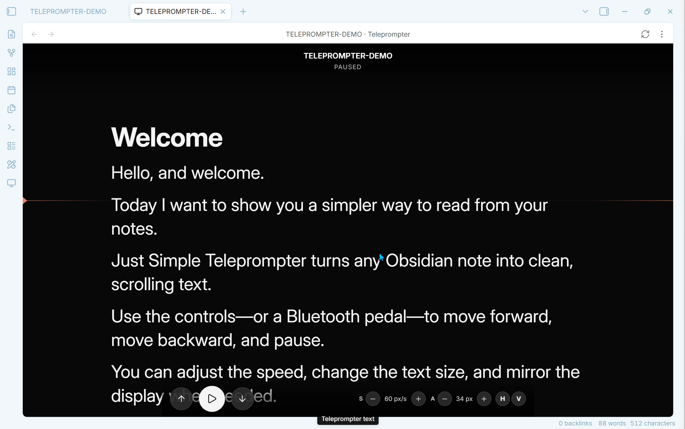

# Just Simple Teleprompter

A deliberately small, local-first teleprompter for Obsidian on desktop, phone, and tablet.

Open any Markdown note, choose a direction, and read. The plugin never modifies the note and makes no network requests.



## Features

- Automatic forward and reverse scrolling with pause/resume.
- Compact controls for speed, text size, and playback, plus configurable line spacing.
- Independent horizontal and vertical mirroring, including both at once.
- Touch, keyboard, and configurable Bluetooth pedal input.
- Phone, tablet, and desktop support with one responsive control bar.
- Automatic source-note refresh without losing position or playback state.
- A reading cue line and optional screen wake lock.
- Fully local, read-only operation with no accounts, telemetry, or network requests.

## Controls

- **Forward** or the right pedal starts continuous forward scrolling.
- **Reverse** or the left pedal starts continuous reverse scrolling.
- While the text is moving, pressing either pedal pauses it.
- To change direction, press once to pause and then press the pedal for the new direction.
- **Pause/Resume** or `Space` pauses and resumes the last direction.
- `ArrowRight`, `ArrowDown`, and `PageDown` act as the right pedal.
- `ArrowLeft`, `ArrowUp`, and `PageUp` act as the left pedal.

Custom pedal keys can be learned from the plugin settings. Pedals must present themselves to the operating system as a Bluetooth keyboard.

## Use

1. Open a Markdown note.
2. Run **Open current note in teleprompter** from the command palette, ribbon, or file menu.
3. Select **Forward** or **Reverse**.

The screen controls hide while the text is moving and return when the view is touched or paused.

Scroll speed, text size, and horizontal/vertical mirroring can all be changed directly from the compact controls in the teleprompter view. Mirror modes remain independent and can be combined for a 180-degree flip. Mirroring affects only the reader; controls remain normally oriented.

All controls share one horizontal bar: transport on the left and speed, text size, and mirror controls on the right. The bar stays at the top in the mobile app so Obsidian's navigation cannot cover it, and at the bottom on desktop. Narrow phone layouts hide only the numeric readouts and keep every button on the same line; wider layouts show the values too.

If the source note is edited in another Obsidian pane or window, the teleprompter refreshes automatically after a short debounce. It keeps its scroll position, selected direction, and paused/running state.

## Mobile support

The runtime uses only Obsidian and browser APIs. It does not depend on Node.js or Electron and declares `isDesktopOnly: false`.

## Privacy

- Network requests: none.
- Accounts, telemetry, ads, and payments: none.
- Vault access: reads only the Markdown note opened in the teleprompter.
- File modifications: none.

## Development note

> Just Simple Teleprompter was unapologetically vibe-coded: built iteratively with AI assistance, then tested and refined inside a real Obsidian vault.

## Development

```sh
npm install
npm run check
```

The release contains exactly `main.js`, `manifest.json`, and `styles.css`.
